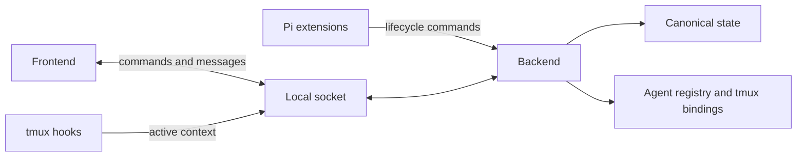
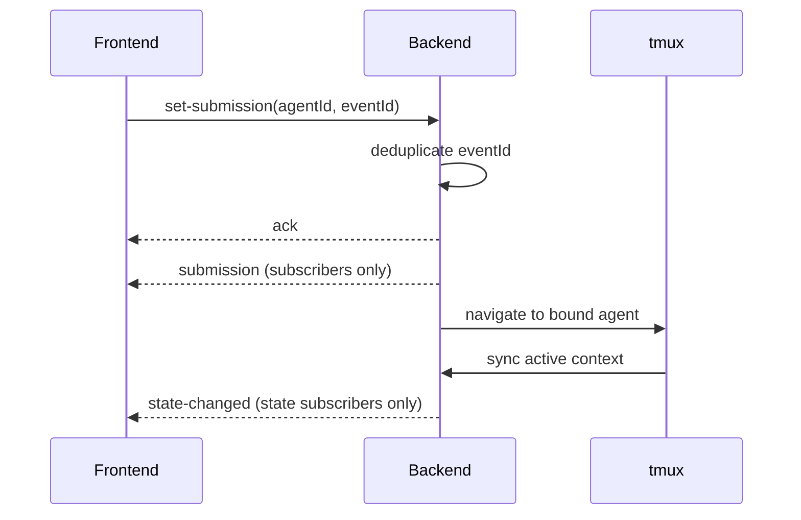

# Architecture

Agent Console coordinates Pi agent metadata, tmux context, and frontend state over a local socket.

## Package responsibilities

| Package | Responsibility |
| --- | --- |
| `packages/protocol` | Shared TypeScript command, event, state, and agent-metadata types. |
| `packages/client` | Socket client used to send manager commands and receive manager messages. |
| `packages/backend` | Canonical state, agent registry, tmux bindings, socket server, search, routing, and navigation. |
| `packages/frontend` | Interactive console UI and tmux plugin/hooks that synchronize active tmux context. |

Repository scripts build packages, launch development binaries, and check local readiness.

## System boundaries

## State and commands

The backend owns `focusId` and `activeId`, each paired with a monotonically increasing revision. Clients can:

- subscribe or request a state snapshot;
- set or clear focus and active state;
- synchronize active tmux session/window/pane context;
- submit a deduplicated navigation event;
- create, update, close, and search registered agents.

A successful command receives an acknowledgement. Invalid commands receive an error response.

## Subscriptions and routing

Subscriptions are topic-specific:

| Topic | Messages |
| --- | --- |
| `state` | `state-snapshot`, `state-changed` |
| `submissions` | `submission` |
| `lifecycle` | `agent.created`, `instance.updated`, `instance.closed` |

Commands are never broadcast wholesale. The backend publishes only resulting state or events to subscribers of the relevant topic.

## Agent lifecycle and tmux bindings

`agent.created` adds an agent to the registry, refreshes tmux bindings, and emits a lifecycle message. `instance.updated` refreshes an existing agent and its bindings; `instance.closed` removes its registry entry and binding.

The backend reconciles registered agents with tmux session, window, and pane bindings. A tmux context synchronization finds the matching bound agent and sets it active. When a newly created or updated agent matches the current tmux context, it also becomes active.

## Submission and navigation

A submission event is emitted once per event ID. If its agent has a tmux binding, the backend navigates tmux to that agent. The subsequent tmux synchronization updates active state.
